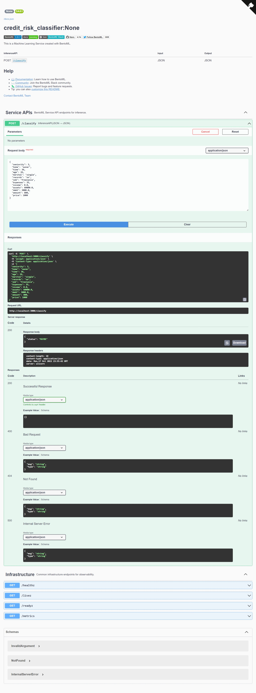

# BentoML How-To

## Installation

By default conda will install the stable version of bentoml which is pretty old.
To make sure that you get the newest one, specify the version.

```bash
conda install bentoml==1.0.0
```

## How to save your model

Once you've developed your model you are going to have to save it in a specific way in order for BentoML to be able to use it.

Add an additional cell under your final model instance and enter the following code.

> **NOTE**: Here our example code predicted credit risk and used a DictVectorizer that we needed to save along with the model in order to pre-process the raw customer data.

```python
import bentoml

bentoml.xgboost.save_model(
    'credit_rist_model', model,
    custom_objects={
        'dictVectorizer': dv,
    })
```

You should see a returned result, such as this:

```bash
Model(tag="credit_risk_model:4mizrjsnbcimqasc", path="/root/bentoml/models/credit_risk_model/4mizrjsnbcimqasc/"))
```

## Basic bentoml script

To run our service, you will need to write a script, similar to this:

```python
add code here...
```

## How to start the server

Since we're in a devolopment environment, we run the server in such a way that it reloads anytime that it detects a change in our files.

```bash
bentoml serve service.py:scv --reload
```

## How to test your server

To see if the server is running and that your code is working properly, open up a browser and navigate to: http://127.0.0.1:3000

From there you can use the Swagger UI in order to test your model.



## BentoML CLI Tool

BentoML has a cli tool that you can use.

### To view saved models

```bash
bentoml models list
 Tag                                 Module           Size        Creation Time
 credit_risk_model:tpaecv2oosyggdg5  bentoml.xgboost  197.51 KiB  2022-10-17 18:37:05
 credit_risk_model:2x3cpmsoms74wdg5  bentoml.xgboost  197.00 KiB  2022-10-17 16:44:11
```

### How to view details of a model

```bash
bentoml models get credit_risk_model:tpaecv2oosyggdg5
name: credit_risk_model
version: tpaecv2oosyggdg5
module: bentoml.xgboost
labels: {}
options:
  model_class: Booster
metadata: {}
context:
  framework_name: xgboost
  framework_versions:
    xgboost: 1.6.2
  bentoml_version: 1.0.7
  python_version: 3.10.6
signatures:
  predict:
    batchable: false
api_version: v2
creation_time: '2022-10-17T23:37:05.460440+00:00'
```

### Sample Bento YML

*bentofile.yaml*:
```yml
service: "service.py:svc"
labels:
  owner: clamytoe
  project: gallery
include:
  - "*.py"
python:
  packages:
    - xgboost
    - sklearn

```

### Build your bento image

```bash
bentoml build
Building BentoML service "credit_risk_classifier:mdxye2korswgedg5" from build context "C:\Users\clamy\Projects\mlbookcamp-code\course-zoomcamp\05-deployment\bento"
Packing model "credit_risk_model:tpaecv2oosyggdg5"
Locking PyPI package versions..
C:\Users\clamy\anaconda3\envs\datasci\lib\site-packages\_distutils_hack\__init__.py:33: UserWarning: Setuptools is replacing distutils.
  warnings.warn("Setuptools is replacing distutils.")

██████╗░███████╗███╗░░██╗████████╗░█████╗░███╗░░░███╗██╗░░░░░
██╔══██╗██╔════╝████╗░██║╚══██╔══╝██╔══██╗████╗░████║██║░░░░░
██████╦╝█████╗░░██╔██╗██║░░░██║░░░██║░░██║██╔████╔██║██║░░░░░
██╔══██╗██╔══╝░░██║╚████║░░░██║░░░██║░░██║██║╚██╔╝██║██║░░░░░
██████╦╝███████╗██║░╚███║░░░██║░░░╚█████╔╝██║░╚═╝░██║███████╗
╚═════╝░╚══════╝╚═╝░░╚══╝░░░╚═╝░░░░╚════╝░╚═╝░░░░░╚═╝╚══════╝

Successfully built Bento(tag="credit_risk_classifier:mdxye2korswgedg5")
```

### A look at a bento

```
(datasci) C:\Users\clamy\bentoml\bentos\credit_risk_classifier\mdxye2korswgedg5>tree /F
Folder PATH listing for volume OS
Volume serial number is 78C2-8958
C:.
│   bento.yaml
│   README.md
│
├───apis
│       openapi.yaml
│
├───env
│   ├───docker
│   │       Dockerfile
│   │       entrypoint.sh
│   │
│   └───python
│           install.sh
│           requirements.lock.txt
│           requirements.txt
│           version.txt
│
├───models
│   └───credit_risk_model
│       │   latest
│       │
│       └───tpaecv2oosyggdg5
│               custom_objects.pkl
│               model.yaml
│               saved_model.ubj
│
└───src
        service.py
```

### Build your Bento Docker container

```bash
bentoml containerize credit_risk_classifier:mdxye2korswgedg5
Building docker image for Bento(tag="credit_risk_classifier:mdxye2korswgedg5")...
Successfully built docker image for "credit_risk_classifier:mdxye2korswgedg5" with tags "credit_risk_classifier:mdxye2korswgedg5"
To run your newly built Bento container, pass "credit_risk_classifier:mdxye2korswgedg5" to "docker run". For example: "docker run -it --rm -p 3000:3000 credit_risk_classifier:mdxye2korswgedg5 serve --production".
```