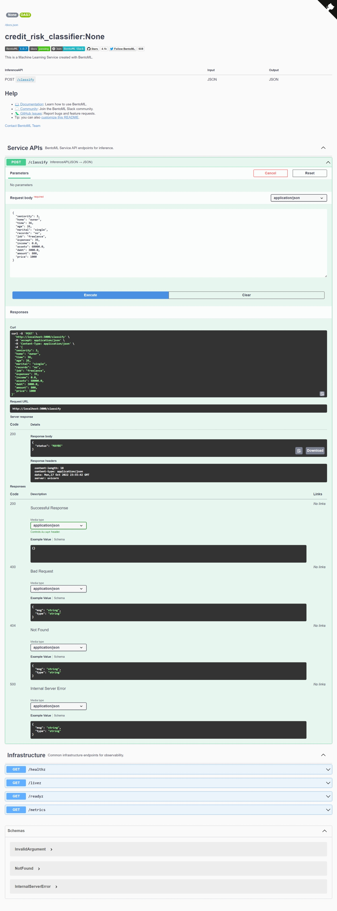

# BentoML How-To

## Installation

By default conda will install the stable version of bentoml which is pretty old.
To make sure that you get the newest one, specify the version.

```bash
conda install bentoml==1.0.0
```

> **NOTE**: Some issues with conda caused me to have to install bentoml and xgboost through pip: `pip install bentoml xgboost`

## How to save your model

Once you've developed your model you are going to have to save it in a specific way in order for BentoML to be able to use it.

Add an additional cell under your final model instance and enter the following code.

> **NOTE**: Here our example code predicted credit risk and used a DictVectorizer that we needed to save along with the model in order to pre-process the raw customer data.

```python
import bentoml

bentoml.xgboost.save_model(
    'credit_rist_model', model,
    custom_objects={
        'dictVectorizer': dv,
    })
```

You should see a returned result, such as this:

```bash
Model(tag="credit_risk_model:4mizrjsnbcimqasc", path="/root/bentoml/models/credit_risk_model/4mizrjsnbcimqasc/"))
```

## Basic bentoml script

To run our service, you will need to write a script, similar to this:

```python
import bentoml
from bentoml.io import JSON
from pydantic import BaseModel


class CreditApplication(BaseModel):
    seniority: int
    home: str
    time: int
    age: int
    marital: str
    records: str
    job: str
    expenses: int
    income: float
    assets: float
    debt: float
    amount: int
    price: int


tag = "credit_risk_model:latest"
model_ref = bentoml.xgboost.get(tag)
dv = model_ref.custom_objects["dictVectorizer"]

model_runner = model_ref.to_runner()

svc = bentoml.Service("credit_risk_classifier", runners=[model_runner])


@svc.api(input=JSON(), output=JSON())
async def classify(application_data: CreditApplication):
    vector = dv.transform(application_data)
    prediction = await model_runner.predict.async_run(vector)

    print(f"####\n{prediction=}\n####")

    result = prediction[0]

    if result > 0.5:
        return {"status": "DECLINED"}
    elif result > 0.23:
        return {"status": "MAYBE"}
    else:
        return {"status": "APPROVED"}
```

## How to start the server

Since we're in a devolopment environment, we run the server in such a way that it reloads anytime that it detects a change in our files.

```bash
bentoml serve service.py:svc --reload
```

## How to test your server

To see if the server is running and that your code is working properly, open up a browser and navigate to: http://127.0.0.1:3000

From there you can use the Swagger UI in order to test your model.



## BentoML CLI Tool

BentoML has a cli tool that you can use.

### To view saved models

```bash
bentoml models list
 Tag                                 Module           Size        Creation Time
 credit_risk_model:tpaecv2oosyggdg5  bentoml.xgboost  197.51 KiB  2022-10-17 18:37:05
 credit_risk_model:2x3cpmsoms74wdg5  bentoml.xgboost  197.00 KiB  2022-10-17 16:44:11
```

### How to view details of a model

```bash
bentoml models get credit_risk_model:tpaecv2oosyggdg5
name: credit_risk_model
version: tpaecv2oosyggdg5
module: bentoml.xgboost
labels: {}
options:
  model_class: Booster
metadata: {}
context:
  framework_name: xgboost
  framework_versions:
    xgboost: 1.6.2
  bentoml_version: 1.0.7
  python_version: 3.10.6
signatures:
  predict:
    batchable: false
api_version: v2
creation_time: '2022-10-17T23:37:05.460440+00:00'
```

### Sample Bento YML

*bentofile.yaml*:
```yml
service: "service.py:svc"
labels:
  owner: clamytoe
  project: gallery
include:
  - "*.py"
python:
  packages:
    - xgboost
    - sklearn

```

### Build your bento image

```bash
bentoml build
Building BentoML service "credit_risk_classifier:mdxye2korswgedg5" from build context "C:\Users\clamy\Projects\mlbookcamp-code\course-zoomcamp\05-deployment\bento"
Packing model "credit_risk_model:tpaecv2oosyggdg5"
Locking PyPI package versions..
C:\Users\clamy\anaconda3\envs\datasci\lib\site-packages\_distutils_hack\__init__.py:33: UserWarning: Setuptools is replacing distutils.
  warnings.warn("Setuptools is replacing distutils.")

██████╗░███████╗███╗░░██╗████████╗░█████╗░███╗░░░███╗██╗░░░░░
██╔══██╗██╔════╝████╗░██║╚══██╔══╝██╔══██╗████╗░████║██║░░░░░
██████╦╝█████╗░░██╔██╗██║░░░██║░░░██║░░██║██╔████╔██║██║░░░░░
██╔══██╗██╔══╝░░██║╚████║░░░██║░░░██║░░██║██║╚██╔╝██║██║░░░░░
██████╦╝███████╗██║░╚███║░░░██║░░░╚█████╔╝██║░╚═╝░██║███████╗
╚═════╝░╚══════╝╚═╝░░╚══╝░░░╚═╝░░░░╚════╝░╚═╝░░░░░╚═╝╚══════╝

Successfully built Bento(tag="credit_risk_classifier:mdxye2korswgedg5")
```

### A look at a bento

```
(datasci) C:\Users\clamy\bentoml\bentos\credit_risk_classifier\mdxye2korswgedg5>tree /F
Folder PATH listing for volume OS
Volume serial number is 78C2-8958
C:.
│   bento.yaml
│   README.md
│
├───apis
│       openapi.yaml
│
├───env
│   ├───docker
│   │       Dockerfile
│   │       entrypoint.sh
│   │
│   └───python
│           install.sh
│           requirements.lock.txt
│           requirements.txt
│           version.txt
│
├───models
│   └───credit_risk_model
│       │   latest
│       │
│       └───tpaecv2oosyggdg5
│               custom_objects.pkl
│               model.yaml
│               saved_model.ubj
│
└───src
        service.py
```

### Build your Bento Docker container

```bash
bentoml containerize credit_risk_classifier:mdxye2korswgedg5
Building docker image for Bento(tag="credit_risk_classifier:mdxye2korswgedg5")...
Successfully built docker image for "credit_risk_classifier:mdxye2korswgedg5" with tags "credit_risk_classifier:mdxye2korswgedg5"
To run your newly built Bento container, pass "credit_risk_classifier:mdxye2korswgedg5" to "docker run". For example: "docker run -it --rm -p 3000:3000 credit_risk_classifier:mdxye2korswgedg5 serve --production".
```

> **NOTE**: If building and deploying on different architecture, it is recommended to specify the target platfor: `--platform=linux/amd64`

### Sample customer

```json
{
  "seniority": 3,
  "home": "owner",
  "time": 36,
  "age": 26,
  "marital": "single",
  "records": "no",
  "job": "freelance",
  "expenses": 35,
  "income": 0.0,
  "assets": 60000.0,
  "debt": 3000.0,
  "amount": 800,
  "price": 1000
}
```

### Latest BentoML Container

```bash
docker run -it --rm -p 3000:3000 credit_risk_classifier:ncsuvz2pusehwdg5 serve --production
```

## Deploying to AWS

First you have to download the AWS CLI application.
Once installed, you can confirm its installation with the following command:

```bash
aws --version
aws-cli/2.8.3 Python/3.9.11 Windows/10 exe/AMD64 prompt/off
```

### Create an Amazon Elastic Container Registry

Once logged in to AWS, search for Amazon Elastic Container Registry and create a new repo.
When you have created one, ensure that you have access keys associated with your account.

### Configure the client

In order to use the aws cli you will first have to associate it with your amazon account:

```bash
aws configure
AWS Access Key ID [None]: ********************
AWS Secret Access Key [None]: ****************************************
Default region name [None]: us-east-1
Default output format [None]:
```

### To verify that your aws cli is configured correctly

```bash
aws s3 ls
2022-10-07 16:19:59 elasticbeanstalk-us-east-1-672763491021
```

### Retrieve authentication token and authenticate your Docker client to your registry:

```bash
aws ecr get-login-password --region us-east-1 | docker login --username AWS --password-stdin 672763491021.dkr.ecr.us-east-1.amazonaws.com
Login Succeeded
```

### Build your Docker image

We've already built our docker image witht he bentoml containerize command, but this is the way that AWS recommends it:

```bash
docker build -t credit-risk-classifier-repo .
```

### Tag your image

```bash
docker images
REPOSITORY                  TAG                                        IMAGE ID       CREATED          SIZE
credit_risk_classifier      ncsuvz2pusehwdg5                           efbb5b21b82d   35 minutes ago   1.13GB
```
tag it:
```bash
docker tag credit_risk_classifier:ncsuvz2pusehwdg5 672763491021.dkr.ecr.us-east-1.amazonaws.com/credit-risk-classifier-repo:latest
```

verify:
```bash
docker images
REPOSITORY                                                                 TAG
   IMAGE ID       CREATED          SIZE
672763491021.dkr.ecr.us-east-1.amazonaws.com/credit-risk-classifier-repo   latest
   efbb5b21b82d   37 minutes ago   1.13GB
```

### Push the image

```bash
docker push 672763491021.dkr.ecr.us-east-1.amazonaws.com/credit-risk-classifier-repo:latest
The push refers to repository [672763491021.dkr.ecr.us-east-1.amazonaws.com/credit-risk-classifier-repo]
3e655892c516: Pushed
6139210e8e02: Pushed
0f0f1a7e330b: Pushed
5d5adf4903b7: Pushed
5f70bf18a086: Pushed
96b1312e0022: Pushed
2c620366414c: Pushed
a45eca1beb35: Pushed
77a749ded6ad: Pushed
19bb62dd79c7: Pushed
bbece258934a: Pushed
c50c24f60154: Pushed
1169b1563e05: Pushed
fe7b1e9bf792: Pushed
latest: digest: sha256:51aab9330996a38086492f062fdb54d8edcb396bd8c06e567b24cc5aa5577ce0 size: 3248
```