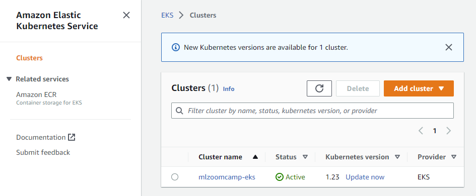
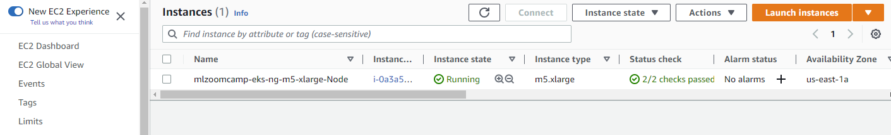
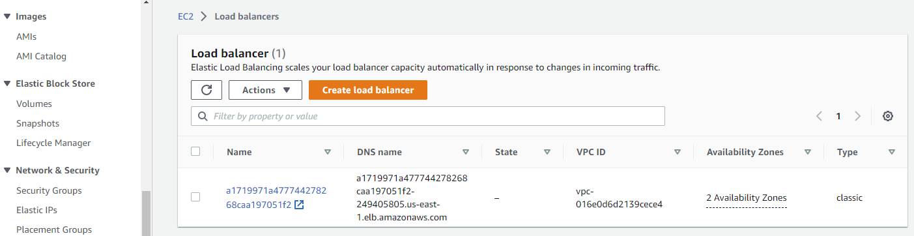
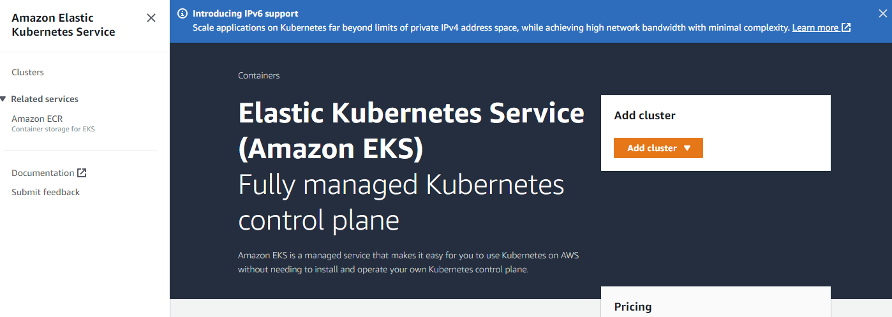
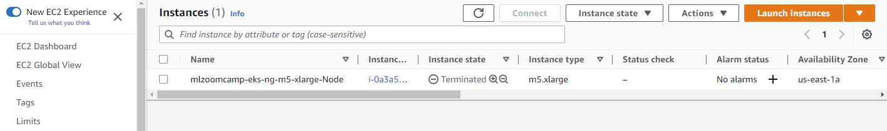
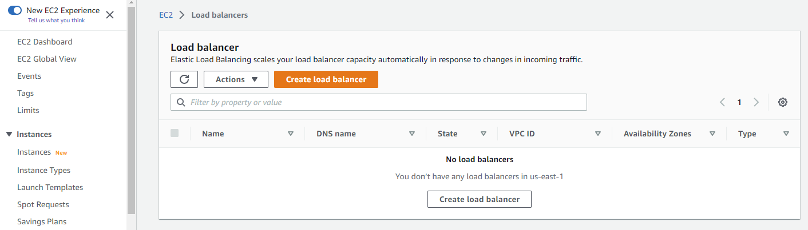
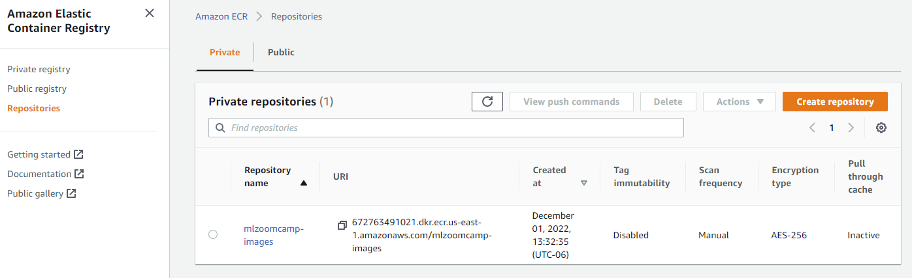

# Kubernetes

## Convert tensorflow model to saved model format

```bash
model_file = 'clothing-model.h5'
ipython
In [1]: import tensorflow as tf
In [2]: from tensorflow import keras
In [3]: model = keras.models.load_model('./clothing-model.h5')
In [4]: model
Out[4]: <keras.engine.functional.Functional at 0x7f8a31d10be0>
In [5]: tf.saved_model.save(model, 'clothing-model')
```

> **NOTE:** `clothing-model` here is the directory where the model will be saved.

## To view the saved model

Keras has a command line utility called `saved_model_cli` that can be used:

```keras
saved_model_cli show --dir clothing-model --all
MetaGraphDef with tag-set: 'serve' contains the following SignatureDefs:

...
signature_def['serving_default']:
  The given SavedModel SignatureDef contains the following input(s):
    inputs['input_8'] tensor_info:
        dtype: DT_FLOAT
        shape: (-1, 299, 299, 3)
        name: serving_default_input_8:0
  The given SavedModel SignatureDef contains the following output(s):
    outputs['dense_7'] tensor_info:
        dtype: DT_FLOAT
        shape: (-1, 10)
        name: StatefulPartitionedCall:0
  Method name is: tensorflow/serving/predict
...
```

> We're mostly interested in the signature defenition.

## Create docker image

We now construct our docker image with the following settings:

* expose port 8500
* create a volume of the model directory
* create environment variable for the model name
* specify the image to use

```docker
docker run -it --rm \
  -p 8500:8500 \
  -v "${PWD}/clothing-model:/models/clothing-model/1" \
  -e MODEL_NAME="clothing-model" \
  tensorflow/serving:2.7.0
```

## Use the service

Full instructions and code are availabel in tf-serving-connect.ipynb

## Package incompatabilities with protobuf

Run the following command to fix:

```bash
pip install --upgrade "protobuf<=3.19.1" "grpcio<=1.42.0" "grpcio-tools<=1.42.0"
pipenv install tensorflow-protobuf==2.11.0
```

## Create pipenv virtual environment

```bash
pipenv install grpcio==1.42.0 flask gunicorn keras-image-helper
```

## Create our custom docker images

### Model

Let's start by creating a Dockerfile for our model:

*image-model.dockerfile:*

```docker
FROM tensorflow/serving:2.7.0

COPY clothing-model /models/clothing-model/1
ENV MODEL_NAME="clothing-model"
```

Then build our image:

```docker
docker build \
  -t zoomcamp-10-model:xception-v4-001 \
  -f image-model.dockerfile \
  .
```

Run it:

```docker
docker run -it --rm \
  -p 8500:8500 \
  zoomcamp-10-model:xception-v4-001
``

Test it:

```bash
pipenv run python gateway.py
{'dress': -1.87986421585083, 'hat': -4.75631046295166, 'longsleeve': -2.359531879425049, 'outwear': -1.08926522731781, 'pants': 9.903782844543457, 'shirt': -2.826179027557373, 'shoes': -3.648310422897339, 'shorts': 3.241154909133911, 'skirt': -2.612096071243286, 't-shirt': -4.852035045623779}
```

### Flask app

Now to create the dockerfile for our flask app:

*image-gateway.dockerfile:*

```docker
FROM python:3.9-slim

RUN pip install pipenv

WORKDIR /app

COPY ["Pipfile", "Pipfile.lock", "./"]

RUN pipenv install --system --deploy

COPY ["gateway.py", "proto.py", "./"]

EXPOSE 9696

ENTRYPOINT ["gunicorn", "--bind=0.0.0.0:9696", "gateway:app"]
```

Build it:

```docker
docker build \
  -t zoomcamp-10-gateway:001 \
  -f image-gateway.dockerfile \
  .
```

Run it:

```docker
docker run -it --rm \
  -p 9696:9696 \
  zoomcamp-10-gateway:001
``

Test it:

```bash
python test.py
Traceback (most recent call last):
  File "/home/clamytoe/miniconda3/envs/py39/lib/python3.9/site-packages/requests/models.py", line 971, in json
    return complexjson.loads(self.text, **kwargs)
  File "/home/clamytoe/miniconda3/envs/py39/lib/python3.9/json/__init__.py", line 346, in loads
    return _default_decoder.decode(s)
  File "/home/clamytoe/miniconda3/envs/py39/lib/python3.9/json/decoder.py", line 337, in decode
    obj, end = self.raw_decode(s, idx=_w(s, 0).end())
  File "/home/clamytoe/miniconda3/envs/py39/lib/python3.9/json/decoder.py", line 355, in raw_decode
    raise JSONDecodeError("Expecting value", s, err.value) from None
json.decoder.JSONDecodeError: Expecting value: line 1 column 1 (char 0)

During handling of the above exception, another exception occurred:

Traceback (most recent call last):
  File "/mnt/c/Users/clamy/Projects/mlbookcamp-code/course-zoomcamp/10-kubernetes/code/test.py", line 7, in <module>
    result = requests.post(url, json=data).json()
  File "/home/clamytoe/miniconda3/envs/py39/lib/python3.9/site-packages/requests/models.py", line 975, in json
    raise RequestsJSONDecodeError(e.msg, e.doc, e.pos)
requests.exceptions.JSONDecodeError: Expecting value: line 1 column 1 (char 0)
```

What happened? The two containers can't communicate with each other.
Let's resolve this next.

## Docker Compose

### Install Docker Compose

```bash
cd
mkdir bin
cd bin/
wget https://github.com/docker/compose/releases/download/v2.13.0/docker-compose-linux-x86_64 -o docker-compose
chmod +x docker-compose
```

> Add the bin directory to your path by adding this line to the end of your .bashrc file: `export PATH="${HOME}/bin:${PATH}"` followed by `source .bashrc` to reload the shell.

### docker-compose.yaml

*docker-compose.yaml:*

```
version: "3.9"
services:
  clothing-model:
    image: zoomcamp-10-model:xception-v4-001
  gateway:
    image: zoomcamp-10-gateway:001
    environment:
      - TF_SERVING_HOST=clothing-model:8500
    ports:
      - "9696:9696"
```

### Starting the services

From the project directory, run the following command:

```bash
docker-compose up
```

Test it:

```bash
python test.py
```

> **NOTE:** To get your terminal back, use the `-d` flag: `docker-compose up -d`

### Stopping the services

```bash
docker-compose down
```

## Introduction to Kubernetes

* **node**: server/container/ec2 instance
* **pod**: docker container, runs on a node
* **deployment**: group of pods with the same image & config
* **service**: entry points to deployments, routes requests to pods
  * **external**: load balancer
  * **internal**: cluster IP
* **ingress**: client facing entry point to cluster
* **HPA**: Horizontal Pod Autoscaler allocates more resources to deployment if it needs them

## Deploy simple service to Kubernetes

Create simple ping application.

1. `mkdir ping; cd $_`
2. `touch Pipfile`
3. `pipenv install flask gunicorn`
4. Create application files:

*ping.py:*

```python
from flask import Flask

app = Flask('ping')

@app.route('/ping', methods=['GET'])
def ping():
    return "PONG"

if __name__ == "__main__":
    app.run(debug=True, host='0.0.0.0', port=9696)
```

*Dockerfile:*

```docker
FROM python:3.9.15-slim

RUN pip install pipenv

WORKDIR /app

COPY ["Pipfile", "Pipfile.lock", "./"]

RUN pipenv install --system --deploy

COPY "ping.py" .

EXPOSE 9696

ENTRYPOINT ["gunicorn", "--bind=0.0.0.0:9696", "ping:app"]
```

5. `docker build -t ping:v001`
6. `docker run -it --rm -p 9696:9696 ping:v001`

Test from another terminal:

```bash
curl localhost:9696/ping
PONG%
```

### Install kubectl

Since we're going to be deploying on AWS, might as well install kubectl from Amazon: [https://docs.aws.amazon.com/eks/latest/userguide/install-kubectl.html](https://docs.aws.amazon.com/eks/latest/userguide/install-kubectl.html)

```bash
cd ~/bin
curl -o kubectl https://s3.us-west-2.amazonaws.com/amazon-eks/1.24.7/2022-10-31/bin/linux/amd64/kubectl
chmod +x kubectl
```

### Install kind

kind: [https://kind.sigs.k8s.io/docs/user/quick-start/#installation](https://kind.sigs.k8s.io/docs/user/quick-start/#installation)

```bash
cd ~/bin
wget -c https://kind.sigs.k8s.io/dl/v0.17.0/kind-linux-amd64 -O kind
chmod +x kind
```

### Create cluster

```bash
kind create cluster
Creating cluster "kind" ...
 ✓ Ensuring node image (kindest/node:v1.25.3) 🖼
 ✓ Preparing nodes 📦
 ✓ Writing configuration 📜
 ✓ Starting control-plane 🕹️
 ✓ Installing CNI 🔌
 ✓ Installing StorageClass 💾
Set kubectl context to "kind-kind"
You can now use your cluster with:

kubectl cluster-info --context kind-kind

Thanks for using kind! 😊
```

See details:

```bash
kubectl cluster-info --context kind-kind
Kubernetes control plane is running at https://127.0.0.1:44153
CoreDNS is running at https://127.0.0.1:44153/api/v1/namespaces/kube-system/services/kube-dns:dns/proxy

To further debug and diagnose cluster problems, use 'kubectl cluster-info dump'.
```

To view all of the services that are running in our cluster:

```bash
kubectl get service
NAME         TYPE        CLUSTER-IP   EXTERNAL-IP   PORT(S)   AGE
kubernetes   ClusterIP   10.96.0.1    <none>        443/TCP   5m46s
```

To view pods:

```bash
kubectl get pod
No resources found in default namespace.
```

To view deployments:

```bash
kubectl get deployment
No resources found in default namespace.
```

Can also use:

```docker
docker ps
CONTAINER ID   IMAGE                  COMMAND                  CREATED         STATUS         PORTS
  NAMES
7dbe1bba4193   kindest/node:v1.25.3   "/usr/local/bin/entr…"   9 minutes ago   Up 9 minutes   127.0.0.1:44153->6443/tcp   kind-control-plane
```

### Create a deployment

It is recommended to install the Kubernetes extension from Microsoft for VSCode.
With the extension, simply type `deployment`and a pop-up will show up, click it and it will create the following file structure, ready for you to fill it in:

*deployment.yaml:*

```yaml
apiVersion: apps/v1
kind: Deployment
metadata:
  name: ping-deployment
spec:
  replicas: 1
  selector:
    matchLabels:
      app: ping
  template:
    metadata:
      labels:
        app: ping
    spec:
      containers:
      - name: ping-pod
        image: ping:v001
        resources:
          limits:
            memory: "128Mi"
            cpu: "200m"
        ports:
        - containerPort: 9696
```

To use our `deployment.yaml`:

```bash
kubectl apply -f deployment.yaml
deployment.apps/ping-deployment created
```

To confirm:

```bash
kubectl get deployment
NAME              READY   UP-TO-DATE   AVAILABLE   AGE
ping-deployment   0/1     1            0           36s
```

Check the pod:

```bash
kubectl get pod
NAME                               READY   STATUS             RESTARTS   AGE
ping-deployment-7459f4b7c7-zrjlx   0/1     ImagePullBackOff   0          2m35s
```

Let's see what's wrong with the pod:

```bash
kubectl describe pod ping-deployment-7459f4b7c7-zrjlx
Name:             ping-deployment-7459f4b7c7-zrjlx
Namespace:        default
Priority:         0
Service Account:  default
Node:             kind-control-plane/172.21.0.2
Start Time:       Mon, 28 Nov 2022 21:32:28 -0600
Labels:           app=ping
                  pod-template-hash=7459f4b7c7
Annotations:      <none>
Status:           Pending
IP:               10.244.0.5
IPs:
  IP:           10.244.0.5
Controlled By:  ReplicaSet/ping-deployment-7459f4b7c7
Containers:
  ping-pod:
    Container ID:
    Image:          ping:v001
    Image ID:
    Port:           9696/TCP
    Host Port:      0/TCP
    State:          Waiting
      Reason:       ImagePullBackOff
    Ready:          False
    Restart Count:  0
    Limits:
      cpu:     200m
      memory:  128Mi
    Requests:
      cpu:        200m
      memory:     128Mi
    Environment:  <none>
    Mounts:
      /var/run/secrets/kubernetes.io/serviceaccount from kube-api-access-7t6lh (ro)
Conditions:
  Type              Status
  Initialized       True
  Ready             False
  ContainersReady   False
  PodScheduled      True
Volumes:
  kube-api-access-7t6lh:
    Type:                    Projected (a volume that contains injected data from multiple sources)
    TokenExpirationSeconds:  3607
    ConfigMapName:           kube-root-ca.crt
    ConfigMapOptional:       <nil>
    DownwardAPI:             true
QoS Class:                   Guaranteed
Node-Selectors:              <none>
Tolerations:                 node.kubernetes.io/not-ready:NoExecute op=Exists for 300s
                             node.kubernetes.io/unreachable:NoExecute op=Exists for 300s
Events:
  Type     Reason     Age                    From               Message
  ----     ------     ----                   ----               -------
  Normal   Scheduled  4m19s                  default-scheduler  Successfully assigned default/ping-deployment-7459f4b7c7-zrjlx to kind-control-plane
  Normal   Pulling    2m46s (x4 over 4m19s)  kubelet            Pulling image "ping:v001"
  Warning  Failed     2m46s (x4 over 4m18s)  kubelet            Failed to pull image "ping:v001": rpc error: code = Unknown desc = failed to pull and unpack image "docker.io/library/ping:v001": failed to resolve reference "docker.io/library/ping:v001": pull access denied, repository does not exist or may require authorization: server message: insufficient_scope: authorization failed
  Warning  Failed     2m46s (x4 over 4m18s)  kubelet            Error: ErrImagePull
  Warning  Failed     2m34s (x6 over 4m18s)  kubelet            Error: ImagePullBackOff
  Normal   BackOff    2m21s (x7 over 4m18s)  kubelet            Back-off pulling image "ping:v001"
```

So it wasn't able to pull the image. Let's load the image with `kind`.

```bash
kind load docker-image ping:v001
Image: "" with ID "sha256:dea78965b2136d6f50c733b38466b2433e91ab4cd55eda69761d45ad7b37f7e0" not yet present on node "kind-control-plane", loading...
```

Check the pod once again:

```bash
kubectl get pod
NAME                               READY   STATUS    RESTARTS   AGE
ping-deployment-7459f4b7c7-zrjlx   1/1     Running   0          10m
```

#### Test the deployment

We will use port forwarding to test our deployment

```bash
kubectl port-forward ping-deployment-7459f4b7c7-zrjlx 9696:9696
Forwarding from 127.0.0.1:9696 -> 9696
Forwarding from [::1]:9696 -> 9696
```

From another terminal:

```bash
curl localhost:9696/ping
PONG%
```

On our port-forwarding terminal we should see:

```bash
Handling connection for 9696
```

### Create a service

*service.yaml:*

```yaml
apiVersion: v1
kind: Service
metadata:
  name: ping
spec:
  type: LoadBalancer
  selector:
    app: ping
  ports:
  - port: 80
    targetPort: 9696

```

To create the service:

```bash
kubectl apply -f service.yaml
service/ping created
```

To confirm:

```bash
kubectl get service
NAME         TYPE           CLUSTER-IP     EXTERNAL-IP   PORT(S)        AGE
kubernetes   ClusterIP      10.96.0.1      <none>        443/TCP        45m
ping         LoadBalancer   10.96.65.155   <pending>     80:31287/TCP   37s
```

**NOTE:** `kubectl get svc` is a shortcut

#### Test the service

Since we don't have an external IP address, we'll pretend with port-forwarding.

```bash
kubectl port-forward service/ping 8080:80
Forwarding from 127.0.0.1:8080 -> 9696
Forwarding from [::1]:8080 -> 9696
```

From a second terminal:

```bash
curl localhost:8080/ping
PONG%
```

You will see `Handling connection for 8080` on the port-fowarding terminal.

## Deploy with Kubernetes

Create a directory to keep all of the configuration files:

```bash
mkdir kube-config;cd $_
```

### Model deployment

*model-deployment.yaml:*

```yaml
apiVersion: apps/v1
kind: Deployment
metadata:
  name: tf-serving-clothing-model
spec:
  replicas: 1
  selector:
    matchLabels:
      app: tf-serving-clothing-model
  template:
    metadata:
      labels:
        app: tf-serving-clothing-model
    spec:
      containers:
      - name: tf-serving-clothing-model
        image: zoomcamp-10-model:xception-v4-001
        resources:
          limits:
            memory: "512Mi"
            cpu: "0.5"
        ports:
        - containerPort: 8500
```

Load it:

```bash
kind load docker-image zoomcamp-10-model:xception-v4-001
Image: "" with ID "sha256:8a46b112a37a49484f0e2a3e77445fa283d229f30a5290e81c5995a9429eb69e" not yet present on node "kind-control-plane", loading...
```

Apply the config:

```bash
kubectl apply -f model-deployment.yaml
deployment.apps/tf-serving-clothing-model created
```

Confirm it:

```bash
kubectl get pod
NAME                                         READY   STATUS    RESTARTS      AGE
ping-deployment-7459f4b7c7-zrjlx             1/1     Running   1 (12m ago)   18h
tf-serving-clothing-model-548c65975d-6c6xk   1/1     Running   0             48s
```

Test it:

```bash
kubectl port-forward tf-serving-clothing-model-548c65975d-6c6xk 8500:8500
```

Second terminal:

```bash
python gateway.py
{'dress': -1.8682903051376343, 'hat': -4.761245250701904, 'longsleeve': -2.316983461380005, 'outwear': -1.0625708103179932, 'pants': 9.887161254882812, 'shirt': -2.8124334812164307, 'shoes': -3.6662826538085938, 'shorts': 3.200361728668213, 'skirt': -2.6023378372192383, 't-shirt': -4.835046291351318}
```

### Model service

*model-service.yaml:*

```yaml
apiVersion: v1
kind: Service
metadata:
  name: tf-serving-clothing-model
spec:
  selector:
    app: tf-serving-clothing-model
  ports:
  - port: 8500
    targetPort: 8500
```

Apply the service:

```bash
kubectl apply -f model-service.yaml
service/tf-serving-clothing-model created
```

Confirm it:

```bash
kubectl get service
NAME                        TYPE           CLUSTER-IP     EXTERNAL-IP   PORT(S)        AGE
kubernetes                  ClusterIP      10.96.0.1      <none>        443/TCP        19h
ping                        LoadBalancer   10.96.65.155   <pending>     80:31287/TCP   19h
tf-serving-clothing-model   ClusterIP      10.96.127.53   <none>        8500/TCP       12s
```

Test it:

```bash
kubectl port-forward service/tf-serving-clothing-model 8500:8500
```

From another terminal:

```bash
python gateway.py
{'dress': -1.8682903051376343, 'hat': -4.761245250701904, 'longsleeve': -2.316983461380005, 'outwear': -1.0625708103179932, 'pants': 9.887161254882812, 'shirt': -2.8124334812164307, 'shoes': -3.6662826538085938, 'shorts': 3.200361728668213, 'skirt': -2.6023378372192383, 't-shirt': -4.835046291351318}
```

### Gateway deployment

*gateway-deployment.yaml:*

```yaml
apiVersion: apps/v1
kind: Deployment
metadata:
  name: gateway
spec:
  selector:
    matchLabels:
      app: gateway
  template:
    metadata:
      labels:
        app: gateway
    spec:
      containers:
      - name: gateway
        image: zoomcamp-10-gateway:001
        resources:
          limits:
            memory: "128Mi"
            cpu: "100m"
        ports:
        - containerPort: 9696
        env:
          - name: TF_SERVING_HOST
            value: tf-serving-clothing-model.default.svc.cluster.local:8500
```

Load the image:

```bash
kind load docker-image zoomcamp-10-gateway:001
Image: "" with ID "sha256:0a5ece7262cc426012efd3d1a528cba224024f82813c7aad78cf6493027829a8" not yet present on node "kind-control-plane", loading...
```

Before deploying the gateway, lets test it.

```bash
kubectl get pod
ping-deployment-8685fcdbdb-6z66p             1/1     Running   0          85m
tf-serving-clothing-model-548c65975d-6c6xk   1/1     Running   0          90m
```

Let's get into the ping pod:

```bash
kubectl exec -it ping-deployment-8685fcdbdb-6z66p -- bash
root@ping-deployment-8685fcdbdb-6z66p:/app# apt update
root@ping-deployment-8685fcdbdb-6z66p:/app# apt install curl
root@ping-deployment-8685fcdbdb-6z66p:/app# curl localhost:9696/ping
PONGroot@ping-deployment-8685fcdbdb-6z66p:/app# curl ping.default.svc.cluster.local/ping
PONGroot@ping-deployment-8685fcdbdb-6z66p:/app# apt install telnet
root@ping-deployment-8685fcdbdb-6z66p:/app# telnet tf-serving-clothing-model.default.svc.cluster.local 8500
Trying 10.96.127.53...
Connected to tf-serving-clothing-model.default.svc.cluster.local.
Escape character is '^]'.
@@ �?
Connection closed by foreign host.
root@ping-deployment-8685fcdbdb-6z66p:/app# exit
exit
command terminated with exit code 1
```

Apply the config:

```bash
kubectl apply -f gateway-deployment.yaml
deployment.apps/gateway created
```

Confirm it:

```bash
kubectl get pod
NAME                                         READY   STATUS    RESTARTS   AGE
gateway-7d46795f85-6vx5n                     1/1     Running   0          43s
ping-deployment-8685fcdbdb-6z66p             1/1     Running   0          161m
tf-serving-clothing-model-548c65975d-6c6xk   1/1     Running   0          166m
```

Forward the port for the gateway:

```bash
kubectl port-forward gateway-7d46795f85-6vx5n 9696:9696
Forwarding from 127.0.0.1:9696 -> 9696
Forwarding from [::1]:9696 -> 9696
Handling connection for 9696
```

Test if from another terminal:

``bash
python ../test.py
{'dress': -1.87986421585083, 'hat': -4.75631046295166, 'longsleeve': -2.359531879425049, 'outwear': -1.08926522731781, 'pants': 9.903782844543457, 'shirt': -2.826179027557373, 'shoes': -3.648310422897339, 'shorts': 3.241154909133911, 'skirt': -2.612096071243286, 't-shirt': -4.852035045623779}

```

If you need to look at the logs:

```bash
kubectl logs gateway-7d46795f85-6vx5n
```

### Gateway service

*gateway-service.yaml:*

```yaml
apiVersion: v1
kind: Service
metadata:
  name: gateway
spec:
  type: LoadBalancer
  selector:
    app: gateway
  ports:
  - port: 80
    targetPort: 9696
```

Apply it:

```bash
kubectl apply -f gateway-service.yaml
service/gateway created
```

Confirm it:

```bash
kubectl get service
NAME                        TYPE           CLUSTER-IP     EXTERNAL-IP   PORT(S)        AGE
gateway                     LoadBalancer   10.96.118.39   <pending>     80:31630/TCP   72s
kubernetes                  ClusterIP      10.96.0.1      <none>        443/TCP        23h
ping                        LoadBalancer   10.96.65.155   <pending>     80:31287/TCP   22h
tf-serving-clothing-model   ClusterIP      10.96.127.53   <none>        8500/TCP       3h55m
```

Test it:

```bash
kubectl port-forward service/gateway 8080:80
Forwarding from 127.0.0.1:8080 -> 9696
Forwarding from [::1]:8080 -> 9696
```

From another terminal:

**NOTE:** Don't forget to change the port setting to `8080` in the test.py script!

```bash
python ../test.py
{'dress': -1.87986421585083, 'hat': -4.75631046295166, 'longsleeve': -2.359531879425049, 'outwear': -1.08926522731781, 'pants': 9.903782844543457, 'shirt': -2.826179027557373, 'shoes': -3.648310422897339, 'shorts': 3.241154909133911, 'skirt': -2.612096071243286, 't-shirt': -4.852035045623779}
```

## Deploying to EKS

Now that we have all of the config files ready, we can move on to deploying it all to AWS EKS.
Although this can be done from the AWS management console, it is much easier through the command line.
Head over to [https://docs.aws.amazon.com/eks/latest/userguide/eksctl.html](https://docs.aws.amazon.com/eks/latest/userguide/eksctl.html) and download `ekxctl`.

```bash
cd ~/bin
wget https://github.com/weaveworks/eksctl/releases/latest/download/eksctl_$(uname -s)_amd64.tar.gz
eksctl_Linux_amd64.tar.gz    100%[=============================================>]  30.01M  4.88MB/s    in 8.3s

2022-12-01 13:21:05 (3.63 MB/s) - ‘eksctl_Linux_amd64.tar.gz’ saved [31470597/31470597]
tar xzfv eksctl_Linux_amd64.tar.gz
rm *.gz
```

### Create EKS cluster

Let's create an eks config file to handle all of the options:

*eks-config.yaml:*

```yaml
apiVersion: eksctl.io/v1alpha5
kind: ClusterConfig

metadata:
  name: mlzoomcamp-eks
  region: us-east-1

nodeGroups:
  - name: ng-m5-xlarge
    instanceType: m5.xlarge
    desiredCapacity: 1
```

```bash
eksctl create cluster -f eks-config.yaml
2022-12-01 13:30:09 [ℹ]  eksctl version 0.122.0
2022-12-01 13:30:09 [ℹ]  using region us-east-1
2022-12-01 13:30:10 [ℹ]  skipping us-east-1e from selection because it doesn't support the following instance type(s): m5.xlarge
2022-12-01 13:30:10 [ℹ]  setting availability zones to [us-east-1a us-east-1d]
2022-12-01 13:30:10 [ℹ]  subnets for us-east-1a - public:192.168.0.0/19 private:192.168.64.0/19
2022-12-01 13:30:10 [ℹ]  subnets for us-east-1d - public:192.168.32.0/19 private:192.168.96.0/19
2022-12-01 13:30:11 [ℹ]  nodegroup "ng-m5-xlarge" will use "ami-0c9424a408e18bcc9" [AmazonLinux2/1.23]
2022-12-01 13:30:11 [ℹ]  using Kubernetes version 1.23
2022-12-01 13:30:11 [ℹ]  creating EKS cluster "mlzoomcamp-eks" in "us-east-1" region with un-managed nodes
2022-12-01 13:30:11 [ℹ]  1 nodegroup (ng-m5-xlarge) was included (based on the include/exclude rules)
2022-12-01 13:30:11 [ℹ]  will create a CloudFormation stack for cluster itself and 1 nodegroup stack(s)
2022-12-01 13:30:11 [ℹ]  will create a CloudFormation stack for cluster itself and 0 managed nodegroup stack(s)
2022-12-01 13:30:11 [ℹ]  if you encounter any issues, check CloudFormation console or try 'eksctl utils describe-stacks --region=us-east-1 --cluster=mlzoomcamp-eks'
2022-12-01 13:30:11 [ℹ]  Kubernetes API endpoint access will use default of {publicAccess=true, privateAccess=false} for cluster "mlzoomcamp-eks" in "us-east-1"
2022-12-01 13:30:11 [ℹ]  CloudWatch logging will not be enabled for cluster "mlzoomcamp-eks" in "us-east-1"
2022-12-01 13:30:11 [ℹ]  you can enable it with 'eksctl utils update-cluster-logging --enable-types={SPECIFY-YOUR-LOG-TYPES-HERE (e.g. all)} --region=us-east-1 --cluster=mlzoomcamp-eks'
2022-12-01 13:30:11 [ℹ]
2 sequential tasks: { create cluster control plane "mlzoomcamp-eks",
    2 sequential sub-tasks: {
        wait for control plane to become ready,
        create nodegroup "ng-m5-xlarge",
    }
}
2022-12-01 13:30:11 [ℹ]  building cluster stack "eksctl-mlzoomcamp-eks-cluster"
2022-12-01 13:30:11 [ℹ]  deploying stack "eksctl-mlzoomcamp-eks-cluster"
2022-12-01 13:30:41 [ℹ]  waiting for CloudFormation stack "eksctl-mlzoomcamp-eks-cluster"
2022-12-01 13:31:12 [ℹ]  waiting for CloudFormation stack "eksctl-mlzoomcamp-eks-cluster"
2022-12-01 13:32:13 [ℹ]  waiting for CloudFormation stack "eksctl-mlzoomcamp-eks-cluster"
2022-12-01 13:33:13 [ℹ]  waiting for CloudFormation stack "eksctl-mlzoomcamp-eks-cluster"
2022-12-01 13:34:14 [ℹ]  waiting for CloudFormation stack "eksctl-mlzoomcamp-eks-cluster"
2022-12-01 13:35:14 [ℹ]  waiting for CloudFormation stack "eksctl-mlzoomcamp-eks-cluster"
2022-12-01 13:36:15 [ℹ]  waiting for CloudFormation stack "eksctl-mlzoomcamp-eks-cluster"
2022-12-01 13:37:15 [ℹ]  waiting for CloudFormation stack "eksctl-mlzoomcamp-eks-cluster"
2022-12-01 13:38:16 [ℹ]  waiting for CloudFormation stack "eksctl-mlzoomcamp-eks-cluster"
2022-12-01 13:39:17 [ℹ]  waiting for CloudFormation stack "eksctl-mlzoomcamp-eks-cluster"
2022-12-01 13:40:20 [ℹ]  waiting for CloudFormation stack "eksctl-mlzoomcamp-eks-cluster"
2022-12-01 13:41:21 [ℹ]  waiting for CloudFormation stack "eksctl-mlzoomcamp-eks-cluster"
2022-12-01 13:43:25 [ℹ]  building nodegroup stack "eksctl-mlzoomcamp-eks-nodegroup-ng-m5-xlarge"
2022-12-01 13:43:25 [ℹ]  --nodes-min=1 was set automatically for nodegroup ng-m5-xlarge
2022-12-01 13:43:25 [ℹ]  --nodes-max=1 was set automatically for nodegroup ng-m5-xlarge
2022-12-01 13:43:26 [ℹ]  deploying stack "eksctl-mlzoomcamp-eks-nodegroup-ng-m5-xlarge"
2022-12-01 13:43:26 [ℹ]  waiting for CloudFormation stack "eksctl-mlzoomcamp-eks-nodegroup-ng-m5-xlarge"
2022-12-01 13:43:57 [ℹ]  waiting for CloudFormation stack "eksctl-mlzoomcamp-eks-nodegroup-ng-m5-xlarge"
2022-12-01 13:44:45 [ℹ]  waiting for CloudFormation stack "eksctl-mlzoomcamp-eks-nodegroup-ng-m5-xlarge"
2022-12-01 13:45:58 [ℹ]  waiting for CloudFormation stack "eksctl-mlzoomcamp-eks-nodegroup-ng-m5-xlarge"
2022-12-01 13:47:34 [ℹ]  waiting for CloudFormation stack "eksctl-mlzoomcamp-eks-nodegroup-ng-m5-xlarge"
2022-12-01 13:47:34 [ℹ]  waiting for the control plane to become ready
2022-12-01 13:47:34 [✔]  saved kubeconfig as "/home/clamytoe/.kube/config"
2022-12-01 13:47:34 [ℹ]  no tasks
2022-12-01 13:47:34 [✔]  all EKS cluster resources for "mlzoomcamp-eks" have been created
2022-12-01 13:47:35 [ℹ]  adding identity "arn:aws:iam::672763491021:role/eksctl-mlzoomcamp-eks-nodegroup-n-NodeInstanceRole-1AH8IN2NVJMX7" to auth ConfigMap
2022-12-01 13:47:35 [ℹ]  nodegroup "ng-m5-xlarge" has 0 node(s)
2022-12-01 13:47:35 [ℹ]  waiting for at least 1 node(s) to become ready in "ng-m5-xlarge"
2022-12-01 13:48:08 [ℹ]  nodegroup "ng-m5-xlarge" has 1 node(s)
2022-12-01 13:48:08 [ℹ]  node "ip-192-168-1-192.ec2.internal" is ready
2022-12-01 13:48:10 [ℹ]  kubectl command should work with "/home/clamytoe/.kube/config", try 'kubectl get nodes'
2022-12-01 13:48:10 [✔]  EKS cluster "mlzoomcamp-eks" in "us-east-1" region is ready
```

### Create image repository

```bash
aws ecr create-repository --repository-name mlzoomcamp-images
{
    "repository": {
        "repositoryArn": "arn:aws:ecr:us-east-1:672763491021:repository/mlzoomcamp-images",
        "registryId": "672763491021",
        "repositoryName": "mlzoomcamp-images",
        "repositoryUri": "672763491021.dkr.ecr.us-east-1.amazonaws.com/mlzoomcamp-images",
        "createdAt": "2022-12-01T13:32:35-06:00",
        "imageTagMutability": "MUTABLE",
        "imageScanningConfiguration": {
            "scanOnPush": false
        },
        "encryptionConfiguration": {
            "encryptionType": "AES256"
        }
    }
}
```

Automate the uri creation:

```bash
ACCOUNT_ID=672763491021
REGION=us-east-1
REGISTRY_NAME=mlzoomcamp-images
PREFIX=${ACCOUNT_ID}.dkr.ecr.${REGION}.amazonaws.com/${REGISTRY_NAME}

GATEWAY_LOCAL=zoomcamp-10-gateway:001
GATEWAY_REMOTE=${PREFIX}:zoomcamp-10-gateway-001
docker tag ${GATEWAY_LOCAL} ${GATEWAY_REMOTE}

MODEL_LOCAL=zoomcamp-10-model:xception-v4-001
MODEL_REMOTE=${PREFIX}:zoomcamp-10-xception-v4-001
docker tag ${MODEL_LOCAL} ${MODEL_REMOTE}
```

Log into AWS:

```bash
aws ecr get-login-password | docker login --username AWS --password-stdin ${ACCOUNT_ID}.dkr.ecr.${REGION}.amazonaws.com
```

Push our images:

```bash
docker push ${MODEL_REMOTE}
docker push ${GATEWAY_REMOTE}
```

Get the AWS URI's:

```bash
echo ${GATEWAY_REMOTE}
672763491021.dkr.ecr.us-east-1.amazonaws.com/mlzoomcamp-images:zoomcamp-10-gateway-001
(py39) ➜  bin echo ${MODEL_REMOTE}
672763491021.dkr.ecr.us-east-1.amazonaws.com/mlzoomcamp-images:zoomcamp-10-xception-v4-001
```

Look up your node:

```bash
kubectl get nodes
NAME                            STATUS   ROLES    AGE     VERSION
ip-192-168-1-192.ec2.internal   Ready    <none>   5h38m   v1.23.13-eks-fb459a0
```

### Apply the EKS configurations

```bash
kubectl apply -f model-deployment.yaml
deployment.apps/tf-serving-clothing-model created
kubectl apply -f model-service.yaml
service/tf-serving-clothing-model created
kubectl get pod
NAME                                         READY   STATUS    RESTARTS   AGE
tf-serving-clothing-model-5f9bcd9f6d-f8glf   1/1     Running   0          2m23s
kubectl get service
NAME                        TYPE        CLUSTER-IP      EXTERNAL-IP   PORT(S)    AGE
kubernetes                  ClusterIP   10.100.0.1      <none>        443/TCP    5h54m
tf-serving-clothing-model   ClusterIP   10.100.113.48   <none>        8500/TCP   79s
```

### Apply the service deployment

```bash
kubectl port-forward service/tf-serving-clothing-model 8500:8500
Forwarding from 127.0.0.1:8500 -> 8500
Forwarding from [::1]:8500 -> 8500
Handling connection for 8500
E1201 19:35:14.321498    1151 portforward.go:391] error copying from local connection to remote stream: read tcp6 [::1]:8500->[::1]:51748: read: connection reset by peer
```

Test it:

```bash
python gateway.py
{'dress': -1.8682893514633179, 'hat': -4.761244773864746, 'longsleeve': -2.3169822692871094, 'outwear': -1.0625706911087036, 'pants': 9.88715934753418, 'shirt': -2.8124325275421143, 'shoes': -3.6662826538085938, 'shorts': 3.2003581523895264, 'skirt': -2.6023366451263428, 't-shirt': -4.835046291351318}
```

### Apply the gateway deployment

```bash
kubectl apply -f gateway-deployment.yaml
deployment.apps/gateway created
kubectl apply -f gateway-service.yaml
service/gateway created
kubectl get pod
NAME                                         READY   STATUS    RESTARTS   AGE
gateway-54495d55d9-nv5kg                     1/1     Running   0          100s
tf-serving-clothing-model-5f9bcd9f6d-f8glf   1/1     Running   0          11m
kubectl get service
NAME                        TYPE           CLUSTER-IP      EXTERNAL-IP
            PORT(S)        AGE
gateway                     LoadBalancer   10.100.95.50    a1719971a477744278268caa197051f2-249405805.us-east-1.elb.amazonaws.com   80:31806/TCP   101s
kubernetes                  ClusterIP      10.100.0.1      <none>
            443/TCP        6h4m
tf-serving-clothing-model   ClusterIP      10.100.113.48   <none>
            8500/TCP       10m
```

Lets see if we can connect to that external address:

```bash
telnet a1719971a477744278268caa197051f2-249405805.us-east-1.elb.amazonaws.com
```

Forward the ports:

```bash
kubectl port-forward service/gateway 8080:80
Forwarding from 127.0.0.1:8080 -> 9696
Forwarding from [::1]:8080 -> 9696
Handling connection for 8080
```

Test it:

```bash
python test.py
{'dress': -1.8798640966415405, 'hat': -4.75631046295166, 'longsleeve': -2.359531879425049, 'outwear': -1.0892632007598877, 'pants': 9.90378189086914, 'shirt': -2.8261773586273193, 'shoes': -3.6483097076416016, 'shorts': 3.241151809692383, 'skirt': -2.6120948791503906, 't-shirt': -4.852035999298096}
```

Add EKS URL to test script and test it:

*test.py:*

```python
import requests

# url = "http://localhost:9696/predict"
# url = "http://localhost:8080/predict"
url = "http://a1719971a477744278268caa197051f2-249405805.us-east-1.elb.amazonaws.com/predict"

data = {"url": "http://bit.ly/mlbookcamp-pants"}

result = requests.post(url, json=data).json()
print(result)
```

Run it:

```bash
python test.py
{'dress': -1.8798640966415405, 'hat': -4.75631046295166, 'longsleeve': -2.359531879425049, 'outwear': -1.0892632007598877, 'pants': 9.90378189086914, 'shirt': -2.8261773586273193, 'shoes': -3.6483097076416016, 'shorts': 3.241151809692383, 'skirt': -2.6120948791503906, 't-shirt': -4.852035999298096}
```

## AWS Dashboard

You should now be able to see your cluster on your AWS EKS panel:



You should also be able to see your instance from the EC2 Dashboard.



You can also see your loadbalancer in the EC2 Loadbalancer dashboard:



## To stop the EKS Cluster

```bash
eksctl delete cluster --name mlzoomcamp-eks
2022-12-01 20:05:20 [ℹ]  deleting EKS cluster "mlzoomcamp-eks"
2022-12-01 20:05:21 [ℹ]  will drain 1 unmanaged nodegroup(s) in cluster "mlzoomcamp-eks"
2022-12-01 20:05:21 [ℹ]  starting parallel draining, max in-flight of 1
2022-12-01 20:05:21 [ℹ]  cordon node "ip-192-168-1-192.ec2.internal"
2022-12-01 20:05:52 [✔]  drained all nodes: [ip-192-168-1-192.ec2.internal]
2022-12-01 20:05:52 [ℹ]  deleted 0 Fargate profile(s)
2022-12-01 20:05:53 [✔]  kubeconfig has been updated
2022-12-01 20:05:53 [ℹ]  cleaning up AWS load balancers created by Kubernetes objects of Kind Service or Ingress
2022-12-01 20:06:52 [ℹ]
2 sequential tasks: { delete nodegroup "ng-m5-xlarge", delete cluster control plane "mlzoomcamp-eks" [async]
}
2022-12-01 20:06:52 [ℹ]  will delete stack "eksctl-mlzoomcamp-eks-nodegroup-ng-m5-xlarge"
2022-12-01 20:06:52 [ℹ]  waiting for stack "eksctl-mlzoomcamp-eks-nodegroup-ng-m5-xlarge" to get deleted
2022-12-01 20:06:53 [ℹ]  waiting for CloudFormation stack "eksctl-mlzoomcamp-eks-nodegroup-ng-m5-xlarge"
2022-12-01 20:07:23 [ℹ]  waiting for CloudFormation stack "eksctl-mlzoomcamp-eks-nodegroup-ng-m5-xlarge"
2022-12-01 20:07:54 [ℹ]  waiting for CloudFormation stack "eksctl-mlzoomcamp-eks-nodegroup-ng-m5-xlarge"
2022-12-01 20:08:31 [ℹ]  waiting for CloudFormation stack "eksctl-mlzoomcamp-eks-nodegroup-ng-m5-xlarge"
2022-12-01 20:09:43 [ℹ]  waiting for CloudFormation stack "eksctl-mlzoomcamp-eks-nodegroup-ng-m5-xlarge"
2022-12-01 20:09:44 [ℹ]  will delete stack "eksctl-mlzoomcamp-eks-cluster"
2022-12-01 20:09:44 [✔]  all cluster resources were deleted
```

Double check your AWS dashboards to ensure that they are gone.





**NOTE:** It still is listed, but it's terminated and will eventually be removed.





> Our image is there in a disabled state, but we probably want to remove it to avoid storage fees.

## HPA NOTE

Hi! Just in in case the HPA instance does not run correctly even after installing the latest version of Metrics Server from the components.yaml manifest with:

```bash
>>kubectl apply -f <https://github.com/kubernetes-sigs/metrics-server/releases/latest/download/components.yaml>
```

And the targets still appear as `<unknown>`

This worked for me:

```bash
Run >>kubectl edit deploy -n kube-system metrics-server
```

And search for this line:

```bash
args:

* --kubelet-preferred-address-types=InternalIP,ExternalIP,Hostname
```

Add this line in the middle:  `- --kubelet-insecure-tls`

So that it stays like this:

```bash
args:
* --kubelet-insecure-tls
* --kubelet-preferred-address-types=InternalIP,ExternalIP,Hostname
```

Save and run again `>>kubectl get hpa`

## Sample code

```bash
saved_model_cli

docker run -it --rm \
  -p 8500:8500 \
  -v $(pwd)/clothing-model:/models/clothing-model/1 \
  -e MODEL_NAME="clothing-model" \
  tensorflow/serving:2.7.0


docker build -t zoomcamp-10-model:xception-v4-001 \
  -f image-model.dockerfile .

docker run -it --rm \
  -p 8500:8500 \
  zoomcamp-10-model:xception-v4-001

docker build -t zoomcamp-10-gateway:002 \
  -f image-gateway.dockerfile .

docker run -it --rm \
  -p 9696:9696 \
  zoomcamp-10-gateway:001


docker-compose up

docker-compose up -d
docker-compose down

docker build -t ping:v001 .
docker run -it --rm -p 9696:9696 ping:v001


kind create cluster

kubectl get service
kubectl get pod
kubectl get deployment

kubectl apply -f deployment.yaml

kind load docker-image ping:v001
kubectl port-forward ping-deployment-7df687f8cd-tfkgd 9696:9696

kubectl apply -f service.yaml
kubectl port-forward service/ping 8080:80

kind load docker-image zoomcamp-10-model:xception-v4-001

kubectl port-forward tf-serving-clothing-model-85cd4b7fc9-rntfw 8500:8500

kubectl port-forward service/tf-serving-clothing-model 8500:8500

kind load docker-image zoomcamp-10-gateway:002

kubectl exec -it ping-deployment-577d56ccf5-p2bdq -- bash

apt update
apt install curl telnet 
telnet tf-serving-clothing-model.default.svc.cluster.local 8500

kubectl port-forward service/gateway 8080:80


ACCOUNT_ID=387546586013
REGION=eu-west-1
REGISTRY_NAME=mlzoomcamp-images
PREFIX=${ACCOUNT_ID}.dkr.ecr.${REGION}.amazonaws.com/${REGISTRY_NAME}

GATEWAY_LOCAL=zoomcamp-10-gateway:002
GATEWAY_REMOTE=${PREFIX}:zoomcamp-10-gateway-002
docker tag ${GATEWAY_LOCAL} ${GATEWAY_REMOTE}

MODEL_LOCAL=zoomcamp-10-model:xception-v4-001
MODEL_REMOTE=${PREFIX}:zoomcamp-10-model-xception-v4-001
docker tag ${MODEL_LOCAL} ${MODEL_REMOTE}

docker push ${MODEL_REMOTE}
docker push ${GATEWAY_REMOTE}


eksctl create cluster -f eks-config.yaml
eksctl delete cluster --name mlzoomcamp-eks
```

## Clean up commands

First stop all kubectl services:

```bash
kubectl get services
kubectl delete svc [SERVICE_NAME]
kubectl delete svc kubernetes
```

Then delete the cluster:

```bash
kind delete cluster
```

Finally youo can delete the docker image:

```bash
docker images
docker rmi kindest/node
```
